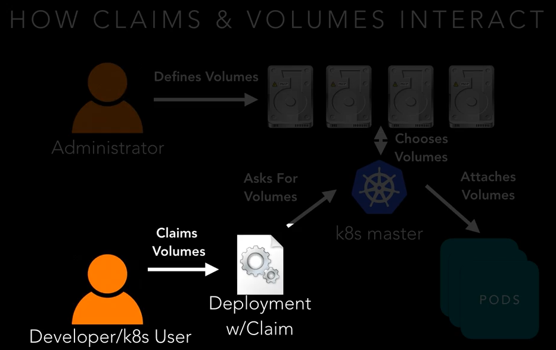
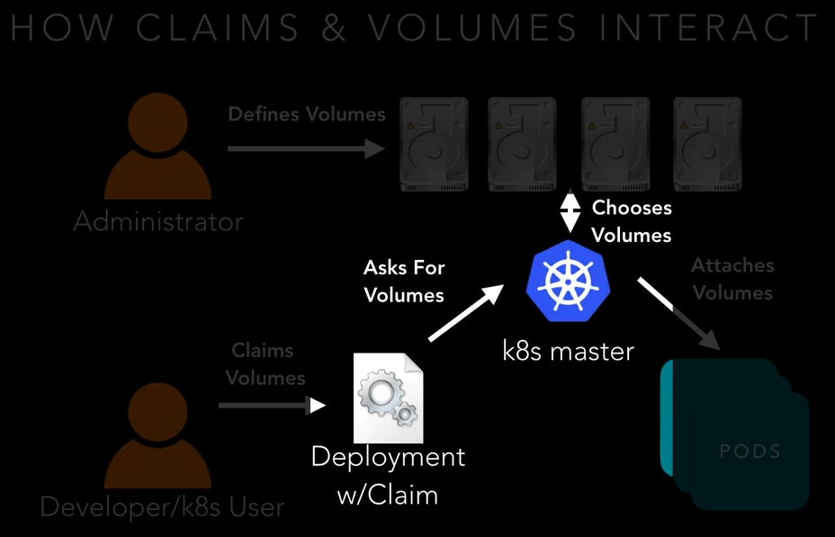
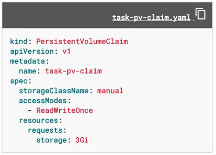
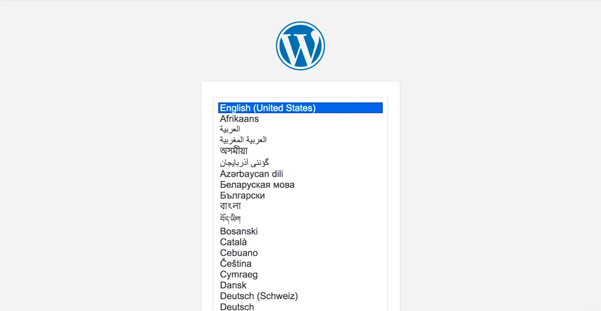
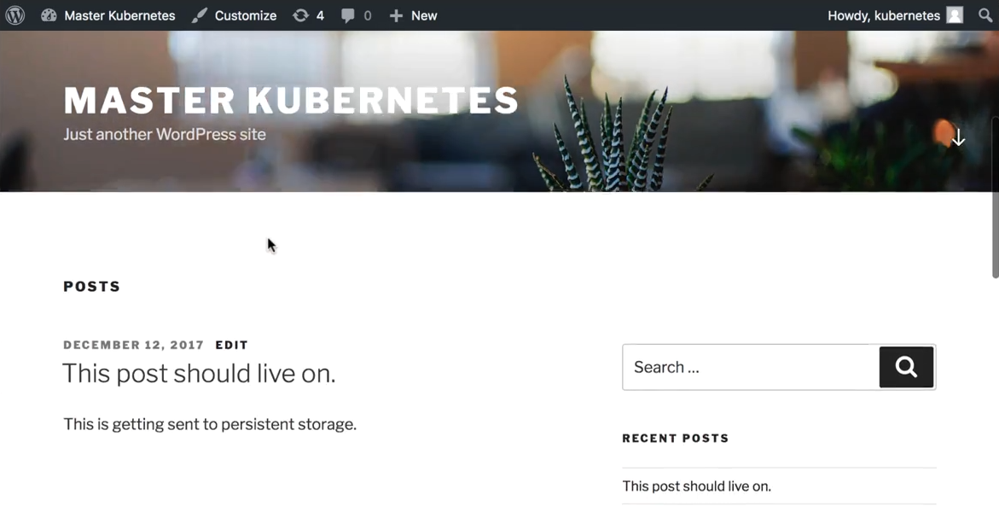

<h1 align="center">
  <br>
  <a href="https://kubernetes.io/"></a>
  <br>
  Kubernetes
  <br>
</h1>

[![Submit Queue Widget]][Submit Queue] [![GoDoc Widget]][GoDoc] [](https://bestpractices.coreinfrastructure.org/projects/569)

## 🚩 Table of Contents

- [Introduction](#introduction)
- [Volumes](#volumes)
  - [Using Volumes](#using-volumes)
  - [Using PersistentVolumes](#using-persistentvolumes)
  - [Creating A Volume](#creating-a-volume)
  - [Claiming A Volume](#claiming-a-volume)
- [YAML Files Explanation](#yaml-files-explanation)
- [Practical Example](#practical-example)
- [References](#-full-kubernetes-references--cheat-sheet)
- [Source Code Example](#-source-code-example)
- [Contributing](#-contributing)
- [License](#-license)

## Introduction

In the [previous lecture](3.Advanced%20-%20DNS%20and%20Service%20Discovery.md) we set up WordPress and MySQL. You can imagine that a WordPress site or an SQL database would really like to have long term reliable and persistent storage for the data entrusted to it. You may know that files created and modified the file system in a docker container are ephemeral, meaning they can only exist for as long as that container is running once it is shutdown or the host running that container is stopped those changes are lost. When the container restarts, it is back to its original state from the original image. This is great for scaling and reliability. Container being stateless and starting with a clean state is a cornerstone of what make Kubernetes and staleless application frameworks work. But on the other hand we need some mechanism other than local storage to provide us with persistence.

To accomplish this computer systems have long used block storage, whether it’s a spinning disk or solid-state drive persistent storage promises to retain data across restarts, scale to relatively large sizes and be somewhat portable between machines. We can’t attach a physical disk to a logical container. That functionality is provided by Kubernetes `volumes`. Since containers exist in the logical world and physical disk exist in the physical world there must be some kind of bridge to define how those two resources are going to react with each other like they do in an actual hardware computer system. Kubernetes provides a logical concept of the persistence volume to connect containers to volumes that Kubernetes then maps to some form of physical storage as it is defined by you the Kubernetes user, administrator or developer. Much like you have many choices in choosing a type of disk for your hardware server or virtual machine in terms of size, speed how and where it is mounted etc. You have those same options and Kubernetes volumes and persistent volumes as well as a few other options that define how these volumes are mounted to pods. When we set up WordPress and MySQL we promise we go deeper into volumes and this is where we’ll do it.

[(Back to top)](#-table-of-contents)

## Volumes
Volumes are like disks but with a little bit more.
- Volumes can be considered just a directory, with some data, which containers in a pod can access
- Kubernetes supports multiple types of volumes that take care of how that data is stored, persisted, and made available
  - Support for a variety of cloud providers’ block store products
  - Support for SAN-type hardware, file systems, etc
  - Support for local volumes (for testing/minikube only! Not production)
- Certain types of Volumes can also provide sharing of files between Pods by being mounted to multiple Pods simultaneously

#### Type of Volumes
This is incomplete and non-comprehensive list. The Kubernetes documentation provides a full list of officially supported volumes.
- Cloud Provider
  - Azure Disk & Azure File
  - AWS EBS
  - Google Compute Engine Persistent Disk
- SAN/File System/Hardware
  - CephFS
  - Fibre Channel
  - GlusterFS
  - NFS
  - iSCSI
  -  Local (For development/minikube only - not supported in production)

### Using Volumes

First pods can specify what volumes they need and where to mount them. They used two different areas to do this. And we’ll look at some specific examples in a moment.
- Using the `spec.volumes` field (what volumes they need)
- Using the `spec.containers.volumeMounts` field (where to mount them)

Processes in the container and then see a file system view of the data in that volume.

What’s important to note here is that volumes let us separate stateless portions of our application the code they needs to run from the stateful data, which is the data which the code runs over.
- The infrastructure can be scaled, maintained, and live separately from the data it works on/with
- Also may ease portability, backup, recovery, and other management tasks in well-architected systems

We need not backup the Docker containers because those live in a repository, however, we need to backup and recover user data in the event of a failure. By separating these two out we've eased the management tasks for both types of data, because they’re remarkably different in some systems.

[(Back to top)](#-table-of-contents)

### Using PersistentVolumes

PersistentVolumes are a Volumes designed to provide persistent disk-like functionality

Using them involves:
1. Provisioning a `PersistentVolume` (akin to creating/installing a disk in a virtual machine or hardware server)
2.  Then, once that disk is created, you establishing a `PersistentVolumeClaim` (it is a request for storage by a user/Pod. That is what maps a given claim or pod to a volume that was created.)

The Kubernetes Master takes care of examining available `PersistentVolumes` and demands from `PersistentVolumeClaims` by running Pods, Kubernetes binds available volumes to Pods based on the options specified by the PersistentVolumeClaims to matching PersistentVolumes (e.g. by name, storage size,  storage class, etc asked for in the Claims)

Let’s look at it visually. First an administrator whether that’s you or someone else defines volumes on your Kubernetes cluster. These volumes can be cloud back disks or actual physical disks in a physical server. It varies by implementation. In Minikube it’s just directories on your laptop or your computer system.


Next, The developer or the  Kubernetes users define claims for volumes they don’t necessarily know nor really should they care where that data is actually being stored, they simply care that it is persistently stored at some point. They can provide a variety of criteria such as storage class, size and the like.



And then it runtime when the deployment is made to the Kubernetes cluster, the Kubernetes Master looks at the claims (or the asks for) volumes.



And matches them with available volume, and attaches those volumes. to the newly created pods.


In certain situations where there’re not enough volumes an error may occur or if auto provisioning (or dynamic provisioning as is called now) is enabled and possible the Master may create new volumes in available space in the could provider or the physical disks attached to the cluster. For now just know that the Kubernetes Master matches claims with volumes and attaches them to pods at runtime. How this happens doesn’t have to be the worry of the administrator or the developer.

[(Back to top)](#-table-of-contents)

### Creating A Volume

First let’s look at how we create a volume. To create a volume you use the `PersistentVolume` object. This definition specifies the type, size and how a volume can be accessed.


The type and access type is highly dependent on the underlying media.
- Local Disk
- Network Mount
- Cloud Block Storage Service
- Directory on the Host (testing only, not for production)

That can dictate the minimum and maximum sizes and whether they’re read-only read/write and whether many people and many containers can read and write at the same time. This is largely a limitation of the underlying media and not something imposed by Kubernetes.

Let’s go look at how this is defined. In the data in the file, you can see a persistent volume that is named `task-pv-volume`.
```yaml
name: task-pv-volume
```

Next in the actual specification under the `spec` property you can see the `storageClassName`. This can be used to defined multiply type storage classes. They are up to us whether it’s SSD, spinning disk, or SAN, this allows you to create different classes of storage that your end-users and your application might need to define in their given claims.

```yaml
spec:
  storageClassName: manual
  capacity:
    storage: 10Gi
  accessModes:
    - ReadWriteOnce
  hostPath:
    path: "/mnt/data"
```

Further you can define the `capacity`. How much `storage` do you want to allocate to this volume.

Next you define the `accessModes`. This is largely dependent on the underlying media. Is it a spinning disk? Is it a network storage volume which can be shared across multiple containers? Can multiple people read it and can multiple people write it? This is highly dependent on the underlying storage media and you’ll probably should consult your hardware documentation or your network administrator or your cloud storage provider what modes need to be specified here. The Kubernetes documentation can help you understand what mode is appropriate for a given cloud provider or a given type of hardware. This varies based on what is provided in the actual persistent storage.

In this example there is a further property `hostPath`. Since this is a local volume it simply provides access to a directory on a host to testing purposes. It doesn't actual create a disk on a cloud provider. This simply says where that data will reside. This is only provided or needed if you’re using the directory on the host for testing purposes and not actually creating a volume on a storage device.

In this case since we’re using a `hostPath` the configuration items  for that particular type of underlying storage are enumerated here. Like the directory on our local host where the data for that volume will be stored. If you are using a different type of storage such as a SAN, NFS, or other type of backing volume. The configuration would look differently. Consult the individual storage providers documentation and the Kubernetes persistent volume documentation for what that might look like, as this varies provider by provider.

### Claiming A Volume

Now that we have volumes created, we have to claim the volume to attach it on to the pods.

Pods use `PersistentVolumeClaims` to request physical storage defined by PersistentVolumes. Kubernetes uses the information in the claim to look for `PersistentVolume` that satisfies the claim's requirements.
- If it finds a match it binds the claim to the volume.
- If it cannot find the match and automatic provisioning isn’t enabled. it results in an error.

Let’s look at the syntax for claiming a volume.



It’s defined by a persistent volume claim. The claim has a `metadata` section with a name just like any other Kubernetes object. In the `spec` the claim specifies what it is requesting. In this situation, this claim is requesting a `manual` storageClass with `ReadWriteOnce` accessibility and it `requests` `3 GB` of `storage`. The Kubernetes control plane will use that information to try and find or if enabled automatically provision a volume that matches those criteria. Once those criteria are met. It will bind it in the runtime configuration in Kubernetes and that will be accessible to the pod at the given mount point.

[(Back to top)](#-table-of-contents)


## YAML Files Explanation

To make this real let's look at adding volumes and volume claims to MySQL and WordPress deployments so that any changes and posts we make in WordPress are persisted not just across container restarts but across other events such as moving in between servers etc.

#### Local Volumes yaml
First let’s take a look at the [local–volumes.yaml](Source%20Code/Advanced%20Kubernetes%20Usage/Volumes/local-volumes.yaml) file. In the local–volumes.yaml file you can see two separate volumes are being declared, this make sense as we need a volume for both MySQL and WordPress. In this case we’re making one each.

```yaml
apiVersion: v1
kind: PersistentVolume
metadata:
  name: local-pv-1
  labels:
    type: local
spec:
  capacity:
    storage: 20Gi
  accessModes:
    - ReadWriteOnce
  hostPath:
    path: /tmp/data/pv-1
```
```yaml
apiVersion: v1
kind: PersistentVolume
metadata:
  name: local-pv-2
  labels:
    type: local
spec:
  capacity:
    storage: 20Gi
  accessModes:
    - ReadWriteOnce
  hostPath:
path: /tmp/data/pv-2
```

They are defined relatively similarly. They follow the same format of the persistent volume that we just spoke about. In this case we’re giving them the names `local-pv-1` and `local-pv-2`.

They are `20Gi` volumes that you can `ReadWriteOnce` that means one person or one container can read and write to them at a time.

Their host path disks meaning they’re not back by an actual magnetic disk, they’re not backed by a SAN storage device or a cloud block storage device. Instead on your minikube it will simply store data somewhere on minikube host in a directory that we specified. In this case is `/tmp/data/pv-1` and `/tmp/data/pv-2`. This creates two empty disks the Kubernetes can use to fulfill persistent volume claims made by each deployment. Let’s go look at each respectively.

#### MySQL Deployment yaml

Let’s considered the [mysql-deployment.yaml](Source%20Code/Advanced%20Kubernetes%20Usage/Volumes/mysql-deployment.yaml). Look relatively familiar to the last one that we used.
```yaml
apiVersion: v1
kind: Service
metadata:
  name: wordpress-mysql
  labels:
    app: wordpress
spec:
  ports:
    - port: 3306
  selector:
    app: wordpress
    tier: mysql
clusterIP: None
```

Looking at this `PersistentVolumeClaim` you can see where it’s named `mysql-pv-claim`. We’re asking for a disk, which is capable, or `ReadWriteOnce`, meaning that one container can read and write to it. It has `20GB` of storage. You'll remember in [local–volumes.yaml](Source%20Code/Advanced%20Kubernetes%20Usage/Volumes/local-volumes.yaml) we actually declared two disks that would meet the criteria. That gives Kubernetes the ability to bind that disk to this claim.
```yaml
apiVersion: v1
kind: PersistentVolumeClaim
metadata:
  name: mysql-pv-claim
  labels:
    app: wordpress
spec:
  accessModes:
    - ReadWriteOnce
  resources:
    requests:
storage: 20Gi
```

Once this disk has been bound to this container, how do we know where it will be mounted? In normal Linux file systems you can mount a disk at any point in the directory structure. This is exactly the same. If you notice the volumes and `volumeMounts` stanzas under this specification or `spec` property, you’ll notice that the `persistentVolumeClaim` and the `persistentVolume` is declared an amount path is specified.

The `name` of the volume is `mysql-persistent-storage` and it references the claim that we just look out above.
```yaml
volumes:
- name: mysql-persistent-storage
persistentVolumeClaim:
  claimName: mysql-pv-claim
```

That claim when fulfilled and when bound will be mounted on the mount path at `/var/lib/mysql` where the docker container expects it. The docker container and the MySQL process running the docker container will write data to that directory.
```yaml
volumeMounts:
- name: mysql-persistent-storage
  mountPath: /var/lib/mysql
```

Since that directory is mounting a persistent disk that data will now be available across restarts.

#### WordPress Deployment yaml

Let’s go check out the [wordpress-deployment.yaml](Source%20Code/Advanced%20Kubernetes%20Usage/Volumes/wordpress-deployment.yaml).This should be similar. The `PersistentVolumeClaim` looks pretty much the same as the MySQL deployment `PersistentVolumeClaim`. In this case the only difference really is the name `wp–pv-claim`.
```yaml
apiVersion: v1
kind: PersistentVolumeClaim
metadata:
  name: wp-pv-claim
  labels:
    app: wordpress
spec:
  accessModes:
    - ReadWriteOnce
  resources:
    requests:
      storage: 20Gi
```

Let’s scroll down and have a look at the `volumeMounts` and the volumes in this case we'll notice a `wordpress-persistent-storage` volume. That’s bound to the persistent volume claim. We can see that it’s being mounted on `/var/www/html`.

```yaml
volumeMounts:
- name: wordpress-persistent-storage
  mountPath: /var/www/html
volumes:
- name: wordpress-persistent-storage
persistentVolumeClaim:
  claimName: wp-pv-claim
```

Again WordPress will write to the `/var/www/html` directory a variety of files such as images and static data that it’s going to need to present your website properly. Now that  directory is actually mounting a volume. Volume brought through a persistent volume claim that data be available across container restarts across movements between nodes or other events that may cause the container to restart. That would other result in data loss.

## Practical Example

Now let’s actually apply these changes to our Minikube. Let’s use the `kubectl create -f` command and specify the [local–volumes.yaml](Source%20Code/Advanced%20Kubernetes%20Usage/Volumes/local-volumes.yaml) file. This will create the two local persistent volumes on our machine.
```
kubectl create -f local-volumes.yaml
```


Then, we can use the `kubectl get persistentvolumes` command to see if they were successfully created.
```
kubectl get persistentvolumes
```


Now that we've create the local volumes, let’s apply the changes, which we’ve looked over in MySQL and WordPress. We'll use the `kubectl apply` command. You'll notice the service went unchanged and it configured the deployment for a new persistent volume claim.
```
kubectl apply -f mysql-deployment.yaml
```


Let’s do the same for WordPress deployment.
```
kubectl apply -f wordpress-deployment.yaml
```


You can ignore for now any error messages or warning messages that indicate about Kubectl apply should only be used on certain resources. You may or may not receive this error message base on your configuration. This error message has more to do with how the resource was created than any error going on right now. Its typically the best practice to use `kubectl apply` over `kubectl create`.

At this point both MySQL and WordPress deployment would have restarted to reflect our changes. But just to be sure let’s issue a `minikube stop` and a `minkube start`.
```
minikube stop
```
```
minikube start
```
This will ensure that we've stopped our cluster and restarted with new disks mounted. Based on the speed of the machine this may take a few moments. Take as much time as you need and once minikube has started come back and start a web browser.

With our web browser started let’s go our minikube and get the URL for our WordPress Instance. If you already have it save it on your clipboard or on your terminal copy it. Remember you can issue  `minikube service wordpress --url` command to get the URL at which this service  is available on your machine.

```
minikube service wordpress --url
```



Let’s continue to set up WordPress and create a sample post. Now that we have some data in both our WordPress and MySQL instances.

Let’s go and delete the pod for WordPress and see what happens.

Let’s return to the terminal window and prepare to delete the pod so we can see what happens and advantages of using persistent disks. Let’s delete the WordPress deployment by using the `kubectl delete deployment wordpress` command.


The deployment was successfully deleted. Let’s ensure that’s the case by trying to reload the page. You can see it's unable to connect. Indeed the deployment is no longer there.


We can verify this with `kubectl get deployments` while SQL is still there our WordPress instance is not.


Let’s re-create the deployment using `kubectl create –f` command and pointing it to the existing file. The file that we used to create deployment.


We may see some errors because remember this file defined three different things. A service, a persistent volume claim and a deployment. The first two still exist, the third does not. As you can notice that `deployment wordpress` was created and the two other resources already exist. That’s fine let’s ask minikube once again for the URL to the new service. Although that shouldn’t have changed. We can use `minikube service wordpress --url` command to do this is we have before.

As you can see even though we re-created the WordPress pod and deployment our work is saved.



We weren't prompted to create a new blog or a new WordPress instance like we were the first time we did it. Instead the persistent volume and the persistent volume claim were assigned to the new pod that we created. Indeed our post lived on. While this may seem simple and nothing really to write home about.

When you consider the power of segregating the stateful parts of your application from the stateless parts of the application and allowing them to manage separately where persistent state is no longer tied to the image and code the required to execute logic in your application.

You can see the power that Kubernetes provides in terms of providing scalable self-healing architecture. This is merely a simple example of how to use volumes. When you consider cloud based storage systems and how volumes are provisioned and de-provisioned and back up you can see it scale this indeed can provide a significant benefit in a properly architected application in a variety of management and also deployment needs. Faster applications which can be managed in a more resilient fashion with less resources and even an automated fashion are possible with Kubernetes, this is simply the basis.


[(Back to top)](#-table-of-contents)

## 🔖 Full Kubernetes references & Cheat Sheet
- kubectl reference: https://kubernetes.io/docs/reference/generated/kubectl/kubectl-commands
- kubectl cheat sheet: https://kubernetes.io/docs/user-guide/kubectl-cheatsheet/


## 📙 Source Code Example
- You can download latest code from [here](https://github.com/yinkokpheng/Kubernetes/tree/master/Source%20Code).

[(Back to top)](#-table-of-contents)

## 💬 Contributing

Your contributions are always welcome! :tada:

1. Fork it!
2. Create your feature branch: `git checkout -b my-new-feature`
3. Commit your changes: `git commit -am 'Add some feature'`
4. Push to the branch: `git push origin my-new-feature`
5. Submit a pull request :D

## 📜 License

The MIT License (MIT) 2018
> GitHub [@yinkokpheng](https://github.com/yinkokpheng)

[GoDoc]: https://godoc.org/k8s.io/kubernetes
[GoDoc Widget]: https://godoc.org/k8s.io/kubernetes?status.svg
[Submit Queue]: http://submit-queue.k8s.io/#/ci
[Submit Queue Widget]: http://submit-queue.k8s.io/health.svg?v=1
