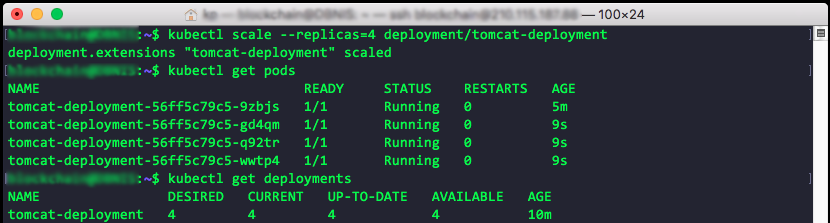
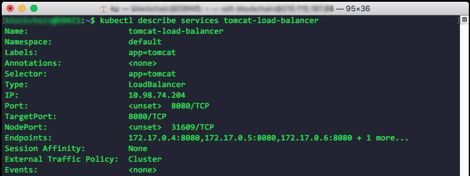
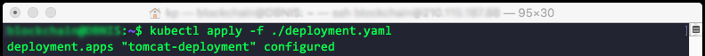

<h1 align="center">
  <br>
  <a href="https://kubernetes.io/"></a>
  <br>
  Kubernetes
  <br>
</h1>

[![Submit Queue Widget]][Submit Queue] [![GoDoc Widget]][GoDoc] [](https://bestpractices.coreinfrastructure.org/projects/569)

## 🚩 Table of Contents

- [Scaling Kubernetes](#scaling-kubernetes)
- [Kubernetes Deployment](#kubernetes-deployment)
- [Labels and Selectors](#labels-and-selectors)
- [Health Checks](#health-checks)
- [Web Interface](#web-interface)
  - [Kubernetes Web UI](#kubernetes-web-ui)
  - [Using The Web UI](#using-the-web-ui)
- [References](#-full-kubernetes-references--cheat-sheet)
- [Source Code Example](#-source-code-example)
- [Contributing](#-contributing)
- [License](#-license)

## Scaling Kubernetes
We continue from [Your First K8S App](#your-first-k8s-app). Replication is an important cornerstone of Kubernetes. Kubernetes supports scaling through replicating pods on the same or multiple nodes. We can define how these replica are built in deployment.yaml or using `kubectl scale` command to scale our existing deployment.

Here is the pod from previous [Your First K8S App](#your-first-k8s-app).


let's scale our deployment by the following command. We will scale tomcat-deployment to 4 replicas.

- kubectl scale command
  ```
  kubectl scale -—replicas=4 deployment/tomcat-deployment
  ```


Now, we have scaled the deployment. Next we will expose pod to outside world. Previously, we defined a "NodePort" service for the Tomcat pod
```
kubectl expose deployment tomcat-deployment --type=NodePort
```
- kubectl expose command.

  let’s define a LoadBalancer service, instead
  ```
  kubectl expose deployment tomcat-deployment --type=LoadBalancer --port=8080 --target-port=8080 --name=tomcat-load-balancer
  ```
  

  let’s see what IP address was assigned for the service
  ```
  kubectl describe services tomcat-load-balancer
  ```
  
  As you can see it’s  assigned an internal IP `10.98.74.204`

[(Back to top)](#-table-of-contents)

## Kubernetes Deployments
- List deployments
  ```
  kubectl get deployments
  ```
  

<br />

- View status of deployment roll outs
  ```
  kubectl rollout status
  ```


<br />

- Set the image of a deployment
  ```
  kubectl set image
  ```
  

<br />

- View the history of a rollout, including previous revisions
  ```
  kubectl rollout history
  ```
  

<br />

## Labels and Selectors

A method to keep things organized, and to help you (a human) and Kubernetes (a machine)
identify resources to act upon.
- Labels are key/value pairs that you can attach to objects like pods
  - They are for users to help describe meaningful and relevant information about an object
  - They do not affect the semantics of the core system
- Selectors are a way of expressing how to select objects based on their labels
  - Selectors are a simple language to define what labels match and which ones done
  - You can specify if a label equals a given criteria or if it fits inside a set of criteria
    - Equality-based
    - Set-based
- You can label nearly anything in the Kubernetes world
  - Deployments
  - Services
  - Nodes
- Let’s use labels to label a node that it has SSD storage and then use a selector to tell the deployment that our app should only ever go onto a node with SSD storage.

- For this example we’re going to use "nodeSelector"
- nodeSelector is a property on a deployment that uses labels and selectors to choose which nodes the master decides to run a given pod on
- To accomplish our goal of running our deployment only on nodes with SSD we will:
  - Label a node as having an SSD
  - Define the nodeSelector on our deployment to match only nodes having
the label we just defined

##### 1. Apply label to nodes
- Get nodes
```
kubectl get nodes
```


<br />

- Label node
```
kubectl label node minikube storageType=ssd
```


<br />

- See detail of node
```
kubectl describe node minikube
```


<br />

##### 2. Apply nodeSelector to deployment

[deployment.yaml](Source%20Code/Basic%20and%20Core%20Concepts/Labels%20%26%20Selectors/deployment.yaml). We added `nodeSelector` and `sotrageType` in this file.
  ```yaml
  apiVersion: apps/v1beta2
  kind: Deployment
  metadata:
    name: tomcat-deployment
  spec:
    selector:
      matchLabels:
        app: tomcat
    replicas: 4
    template:
      metadata:
        labels:
          app: tomcat
      spec:
        containers:
        - name: tomcat
          image: tomcat:9.0
          ports:
          - containerPort: 8080
        nodeSelector:
          storageType: ssd
  ```


Apply the new updated the deployment.yaml file on to Kubernetes cluster. Using the kubectl apply command, allows you to apply changes to the deployment that may not be possible using a variety of Kubectl commands.

For example node selector must be done in the deployment file. Kubernetes is smart enough to understand what changes need to be applied and what is different from the new application of the deployment from the existing one. With this change applied Kubernetes will only deploy Tomcat to nodes that have been labeled with the storage type equaling SSD.

<br />

## Health Checks

Kubernetes has two types of health checks to ascertain two different
things
- Readiness Probes: To determine when a Pod is "ready" (e.g. after it has started to see when it’s ready and has loaded what it needs to internally in the image and is ready to take requests from external services)
- Liveness Probes: To determine when a Pod is "healthy" or "unhealthy" after it has become ready

#### A healthy Tomcat example
What we will check:
- A Readiness Probe will check to make sure the Pod has started and is ready to begin taking requests
- A Liveness Probe on the Tomcat deployment will help us ensure the containers continue to be able to accept and service requests without error in a reasonable amount of time

[deployment.yaml](Source%20Code/Basic%20and%20Core%20Concepts/Health%20Checks/deployment.yaml). We added `livenessProbe` and `readinessProbe` in this file.
```yaml
apiVersion: apps/v1beta2
kind: Deployment
metadata:
  name: tomcat-deployment
spec:
  selector:
    matchLabels:
      app: tomcat
  replicas: 4
  template:
    metadata:
      labels:
        app: tomcat
    spec:
      containers:
      - name: tomcat
        image: tomcat:9.0
        ports:
        - containerPort: 8080
        livenessProbe:
          httpGet:
            path: /
            port: 8080
          initialDelaySeconds: 30
          periodSeconds: 30
        readinessProbe:
          httpGet:
            path: /
            port: 8080
          initialDelaySeconds: 15
          periodSeconds: 3
```


You’ll notice a few differences in a few of properties within each one that’s because we need them to different things.

Remember the `readiness probe` at the bottom of the file is our way of telling Kubernetes how to test to make sure that when it starts to pod that it is ready for work. In this case we'll tell it to access `port 8080` every `3 seconds` after initial delay of `15 seconds` on simply the `/` directory once the succeeds, Kubernetes will know the pod is ready for business.

After that it’ll go to `liveness probe`. Every `30 seconds` after initial delay of `30 seconds` it will use HTTP to access `port 8080` on the `/` path if the HTTP request fails, it’ll deem the pod to be unhealthy. If the HTTP request succeeds it's deemed to be healthy.


<br />

## Web Interface
Up to this point our primary point of contact with Kubernetes has been the Kubectl command line interface. Kubectl continues to be the dominant tool and will be for the remainder of lectures.

However in some situations a web interface is equally useful. Kubernetes provides a web user interface called the dashboard that we can use to access the same information that Kubectl can present in a friendly point and click web interface. It’s called the Dashboard UI.

It runs on your Kubernetes Masters and is accessible directly if you have a direct connection to your cluster or to your Masters. This is unlikely in production situations, however Kubectl is your friend. Kubectl can create a proxy or a tunnel for you from your local workstation to a Kubernetes cluster that you may not direct network access to. Using the Kubectl proxy command.

#### Kubernetes Web UI


- Provides a variety of views for nearly anything in your Kubernetes cluster
- Allows update, deletion, and creation of nearly anything in your Kubernetes cluster
- Accesses the same APIs as kubectl

#### Using The Web UI

- On some Kubernetes clusters the Dashboard UI is pre-installed, on
some it is not (many cloud providers’ Kubernetes services include it)
- Installing the Dashboard, The Dashboard UI is not deployed by default. To deploy it, run the following command:
```
kubectl create -f https://raw.githubusercontent.com/kubernetes/dashboard/master/src/deploy/recommended/kubernetes-dashboard.yaml
```
- Accessing the dashboard (the most fool-proof way)
```
kubectl proxy
```


- Navigate in your web browser
  - http://localhost:8001/ui
  - http://localhost:8001/api/v1/namespaces/kube-system/services/kubernetes-dashboard:/proxy/


## 🔖 Full Kubernetes references & Cheat Sheet
- kubectl reference: https://kubernetes.io/docs/reference/generated/kubectl/kubectl-commands
- kubectl cheat sheet: https://kubernetes.io/docs/user-guide/kubectl-cheatsheet/


## 📙 Source Code Example
- You can download latest code from [here](https://github.com/yinkokpheng/Kubernetes/tree/master/Source%20Code).

[(Back to top)](#-table-of-contents)

## 💬 Contributing

Your contributions are always welcome! :tada:

1. Fork it!
2. Create your feature branch: `git checkout -b my-new-feature`
3. Commit your changes: `git commit -am 'Add some feature'`
4. Push to the branch: `git push origin my-new-feature`
5. Submit a pull request :D

## 📜 License

The MIT License (MIT) 2018
> GitHub [@yinkokpheng](https://github.com/yinkokpheng)

[GoDoc]: https://godoc.org/k8s.io/kubernetes
[GoDoc Widget]: https://godoc.org/k8s.io/kubernetes?status.svg
[Submit Queue]: http://submit-queue.k8s.io/#/ci
[Submit Queue Widget]: http://submit-queue.k8s.io/health.svg?v=1
