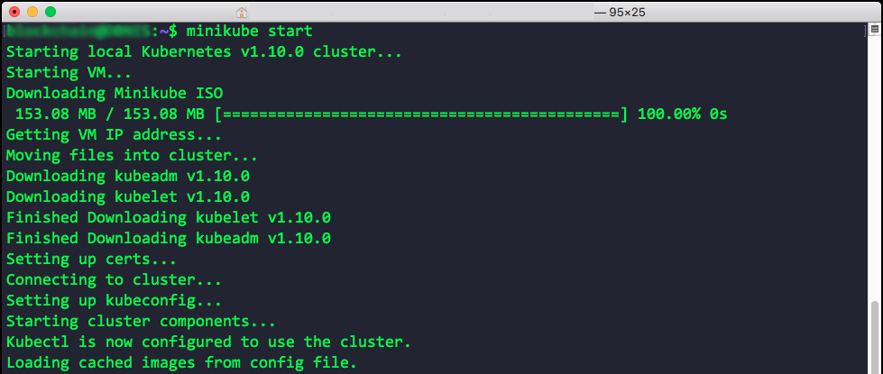
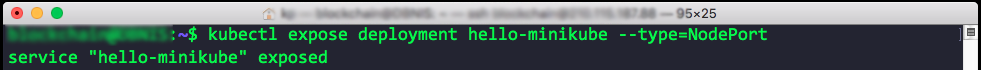
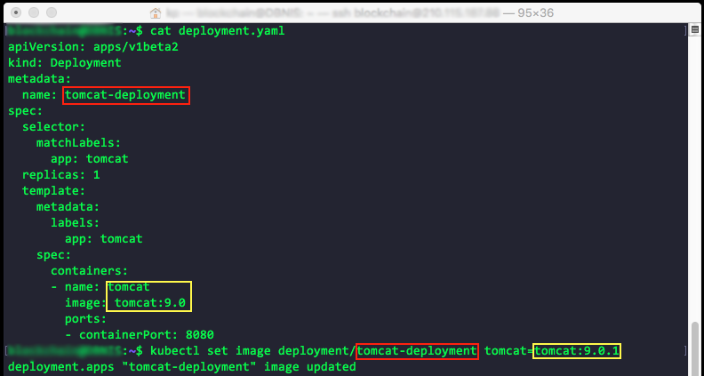

<h1 align="center">
  <br>
  <a href="https://kubernetes.io/"></a>
  <br>
  Kubernetes
  <br>
</h1>

[![Submit Queue Widget]][Submit Queue] [![GoDoc Widget]][GoDoc] [](https://bestpractices.coreinfrastructure.org/projects/569)

----

Kubernetes is an open source system for managing [containerized applications]
across multiple hosts; providing basic mechanisms for deployment, maintenance,
and scaling of applications.

Kubernetes builds upon a decade and a half of experience at Google running
production workloads at scale using a system called [Borg],
combined with best-of-breed ideas and practices from the community.

Kubernetes is hosted by the Cloud Native Computing Foundation ([CNCF]).
If you are a company that wants to help shape the evolution of
technologies that are container-packaged, dynamically-scheduled
and microservices-oriented, consider joining the CNCF.
For details about who's involved and how Kubernetes plays a role,
read the CNCF [announcement].

----

## 🚩 Table of Contents

- [Environment](#environment)
- [Minikube](#minikube-overview)
  - [Install kubectl](#install-kubectl)
  - [Install minikube](#install-minikube)
  - [Basic minikube commands](#basic-minikube-commands)
- [Your First K8S App](#your-first-k8s-app)
- [Basic kubectl commands](#basic-kubectl-commands)
- [Scaling Kubernetes](#scaling-kubernetes)
- [Kubernetes Deployment](#kubernetes-deployment)
- [Labels and Selectors](#labels-and-selectors)
- [Source Code Example](#-source-code-example)
- [Contributing](#-contributing)
- [License](#-license)


## Environment
It depends on who you are & what you’re using it for
- Evaluation/Training - minikube (local version of k8s)
- Development - minikube, dev cluster on a cloud provider
- Deployment - cloud provider or bare metal

[(Back to top)](#-table-of-contents)

## Minikube Overview
- An all-in-one install of Kubernetes
- Takes all the distributed components of Kubernetes and packages them into a single virtual machine to run locally
- A Few (Important) Caveats:
  - Minikube does not support Cloud Provider specific features such as Load Balancers, Persistent Volumes, Ingress (Don’t worry about these yet if you don’t know what these mean!)
  - Minikube requires Virtualization - on Linux Virtualbox must be installed and on OS X either Virtualbox or VMWare Fusion
- Minikube will be a Kubernetes cluster running on your machine
- We’ll start minikube and then connect to it from the kubernetes command line tools (kubectl), just as you will when connecting to kubernetes clusters running remotely

###### Step to install Minikube

- Start with a Linux or Mac OS X machine with a hypervisor installed
- Install kubectl
- Install minikube

[(Back to top)](#-table-of-contents)

## Install kubectl
[Official website](https://kubernetes.io/docs/tasks/tools/install-kubectl/#install-kubectl-binary-via-curl)

### 1. Download the latest package for your OS**
- #### Linux
  ```
  curl -LO https://storage.googleapis.com/kubernetes-release/release/$(curl -s https://storage.googleapis.com/kubernetes-release/release/stable.txt)/bin/linux/amd64/kubectl
  ```

- #### OS X
  ```
  curl -LO https://storage.googleapis.com/kubernetes-release/release/$(curl -s https://storage.googleapis.com/kubernetes-release/release/stable.txt)/bin/darwin/amd64/kubectl
  ```

- #### Windows
  Download the latest release v1.11.0 from [this link](https://storage.googleapis.com/kubernetes-release/release/v1.11.0/bin/windows/amd64/kubectl.exe). Or if you have curl installed, use this command:
  ```
  curl -LO https://storage.googleapis.com/kubernetes-release/release/v1.11.0/bin/windows/amd64/kubectl.exe
  ```
  To find out the latest stable version (for example, for scripting), take a look at https://storage.googleapis.com/kubernetes-release/release/stable.txt.

### 2. Make the binary executable (macOS and Linux only)
  ```
  chmod +x ./kubectl
  ```
### 3. Add the binary to your PATH
- #### Linux
  ```
  sudo mv ./kubectl /usr/local/bin/kubectl
  ```
- #### OS X
  ```
  sudo mv ./kubectl /usr/local/bin/kubectl
  ```
- #### Windows
  Use Explorer to move the kubectl binary to a directory in your path of your choice.

----
- Latest installation instruction for macOS*, Linux, and Windows are always available online:
  - "Install and Set Up kubectl in the Kubernetes Documentation
  - macOS users should consider using the "homebrew" package manager to install and manager kubectl
  - Google Cloud Platform users may also use the Google Cloud Platform tools to install kubectl, consult Google’s SDK for information
----
[(Back to top)](#-table-of-contents)
### Testing kubectl
```
kubectl version
```


**Note:** Version and GitCommit might be different.

[(Back to top)](#-table-of-contents)

## Install minikube
[Official minikude github](https://github.com/kubernetes/minikube/releases)
- #### Linux
  ```
  curl -Lo minikube https://storage.googleapis.com/minikube/releases/v0.28.0/minikube-linux-amd64 && chmod +x minikube && sudo mv minikube /usr/local/bin/
  ```
  Feel free to leave off the `sudo mv minikube /usr/local/bin` if you would like to add minikube to your path manually.

- #### OS X
  ```
  curl -Lo minikube https://storage.googleapis.com/minikube/releases/v0.28.0/minikube-darwin-amd64 && chmod +x minikube && sudo mv minikube /usr/local/bin/
  ```
  Feel free to leave off the `sudo mv minikube /usr/local/bin` if you would like to add minikube to your path manually. Or you can install via homebrew with `brew cask install minikube`

- #### Windows
  Use browser download link from releases [link](https://github.com/kubernetes/minikube/releases)

  ###### Windows [Experimental]
  Download the `minikube-windows-amd64.exe` file, rename it to `minikube.exe` and add it to your path.

  ###### Windows Installer [Experimental]

  Download the `minikube-installer.exe` file, and execute the installer. This will automatically add minikube.exe to your path with an uninstaller available as well.

----
- Latest installation instruction for macOS*, Linux, and Windows are always available online:
  - "Minikube Releases" at the Minikube Github repository
  - Debian-based Linux & Windows users should consider using the installer packages listed at the above URL
----

[(Back to top)](#-table-of-contents)

## Basic minikube commands
- Start minikube
  ```
  minikube start
  ```
  

<br />

- Deploy a sample Kubernetes "deployment" to your local minikube
  ```
  kubectl run hello-minikube --image=gcr.io/google_containers/echoserver:1.4 --port=8080
  ```
  

<br />

- Expose this deployment to an external network
  ```
  kubectl expose deployment hello-minikube --type=NodePort
  ```
  

<br />

- List the “pods” of this deployment
  ```
  kubectl get pod
  ```
  

<br />

- Access the sample service
  ```
  curl $(minikube service hello-minikube --url)
  ```
  

<br />

- Delete the deployment
  ```
  kubectl delete deployment hello-minikube
  ```
  

<br />

- Stop minikube
  ```
  minikube stop
  ```
  

[(Back to top)](#-table-of-contents)

## Your First K8S App
We will deploy the Tomcat App Server using the official docker image.

#### 1. Define the deployment

deployment.yaml file provide Kubernetes with the basic information of what the application needs to do.

- [deployment.yaml](Source%20Code/Introduction%20to%20Kubernetes/Your%20First%20k8s%20App/deployment.yaml)
  ```yaml
  apiVersion: apps/v1beta2
  kind: Deployment
  metadata:
    name: tomcat-deployment
  spec:
    selector:
      matchLabels:
        app: tomcat
    replicas: 1
    template:
      metadata:
        labels:
          app: tomcat
      spec:
        containers:
        - name: tomcat
          image: tomcat:9.0
          ports:
          - containerPort: 8080
  ```

In this file we are going to define
- a deployment name `tomcat–deployment`
- `one replica`, so one instance of one docker image
- image is named `tomcat:9.0`
- docker container `tomcat:9.0` exposes a port `8080` where Tomcat application server will listen by default

**Next**, we will use the kubectl apply command to take the directives from this file
and apply it to our cluster.
```
kubectl apply -f ./deployment.yaml
```


You'll see that the deployment was successfully created.

<br />

**Next step** is to expose the deployment as a service. The kubectl expose command will create the actual service it explore it to the world.
```
kubectl expose deployment tomcat-deployment --type=NodePort
```


<br />

In order to find what port it was created on, we’ll use the minikupe service with the name of the service ––url command.
```
minikube service tomcat-deployment --url
```


This will provide us with the URL including the port number that we can access or given expose service on. Copying this URL we will use curl to access our local service as you can see we will get the HTML of the default Apache Tomcat welcome page.


[(Back to top)](#-table-of-contents)

## Basic kubectl commands
The kubectl command is relatively important in managing Kubernetes. kubectl provides access to both local and remote clusters and is essentially the primary gateway to interacting with any Kubernetes cluster. Since it is the primary command line access tool it’s important to get it know it well.


We'll go over the most common kubectl commands here.


- The kubectl get pods command lists all pods in the namespace. Provides the pod name, how many instances of the pod are running & ready, its status, how many times they have restarted, and their age
  ```
  kubectl get pods
  ```
  

<br />

- kubectl describe pod [pod name], Describes detailed information about all pods or a specified pod (optional pod name argument)
  ```
  kubectl describe pod [pod name]
  ```
  


<br />

- kubectl expose command: Exposes a port (TCP or UDP) for a given deployment, pod, external network, or other resource
  ```
  kubectl expose <type name> <identifier/name> [—port=external port] [—target-port=container-port [—type=service-type]
  ```
  

<br />

- kubectl port-forward command: Forwards one or more local ports to a pod.
  ```
  kubectl port-forward <pod name> [LOCAL_PORT:]REMOTE_PORT]
  ```
  

<br />

- kubectl attach command: Attaches to a process that is already running inside an existing container.
  ```
  kubectl attach <pod name> -c <container>
  ```
  

<br />

- kubectl exec command:
  - Execute a command in a container
  - -i option will pass stdin to the container
  - -t option will specify stdin is a TTY

  ```
  kubectl exec [-it] <pod name> [-c CONTAINER] — COMMAND [args...]
  ```
  

<br />

- kubectl label pods command: Updates the labels on a resource
  ```
  kubectl label [—overwrite] <type> KEY_1=VAL_1 ....
  ```
  

<br />

- kubectl run command: Run a particular image on the cluster
  ```
  kubectl run <name> —image=image
  ```
  

<br />

#### Full Kubernetes references & Cheat Sheet
- kubectl reference: https://kubernetes.io/docs/reference/generated/kubectl/kubectl-commands
- kubectl cheat sheet: https://kubernetes.io/docs/user-guide/kubectl-cheatsheet/

## Scaling Kubernetes
We continue from [Your First K8S App](#your-first-k8s-app). Replication is an important cornerstone of Kubernetes. Kubernetes supports scaling through replicating pods on the same or multiple nodes. We can define how these replica are built in deployment.yaml or using `kubectl scale` command to scale our existing deployment.

Here is the pod from previous [Your First K8S App](#your-first-k8s-app).


let's scale our deployment by the following command. We will scale tomcat-deployment to 4 replicas.

- kubectl scale command
  ```
  kubectl scale -—replicas=4 deployment/tomcat-deployment
  ```


Now, we have scaled the deployment. Next we will expose pod to outside world. Previously, we defined a "NodePort" service for the Tomcat pod
```
kubectl expose deployment tomcat-deployment --type=NodePort
```
- kubectl expose command.

  let’s define a LoadBalancer service, instead
  ```
  kubectl expose deployment tomcat-deployment --type=LoadBalancer --port=8080 --target-port=8080 --name=tomcat-load-balancer
  ```
  

  let’s see what IP address was assigned for the service
  ```
  kubectl describe services tomcat-load-balancer
  ```
  
  As you can see it’s  assigned an internal IP `10.98.74.204`

[(Back to top)](#-table-of-contents)

## Kubernetes Deployments
- List deployments
  ```
  kubectl get deployments
  ```
  

<br />

- View status of deployment roll outs
  ```
  kubectl rollout status
  ```


<br />

- Set the image of a deployment
  ```
  kubectl set image
  ```
  

<br />

- View the history of a rollout, including previous revisions
  ```
  kubectl rollout history
  ```
  

<br />

## Labels and Selectors

A method to keep things organized, and to help you (a human) and Kubernetes (a machine)
identify resources to act upon.
- Labels are key/value pairs that you can attach to objects like pods
  - They are for users to help describe meaningful and relevant information about an object
  - They do not affect the semantics of the core system
- Selectors are a way of expressing how to select objects based on their labels
  - Selectors are a simple language to define what labels match and which ones done
  - You can specify if a label equals a given criteria or if it fits inside a set of criteria
    - Equality-based
    - Set-based
- You can label nearly anything in the Kubernetes world
  - Deployments
  - Services
  - Nodes
- Let’s use labels to label a node that it has SSD storage and then use a selector to tell the deployment that our app should only ever go onto a node with SSD storage.

- For this example we’re going to use “nodeSelector”
- nodeSelector is a property on a deployment that uses labels and selectors to choose which nodes the master decides to run a given pod on
- To accomplish our goal of running our deployment only on nodes with SSD we will:
  - Label a node as having an SSD
  - Define the nodeSelector on our deployment to match only nodes having
the label we just defined

##### 1. Apply label to nodes
- Get nodes
```
kubectl get nodes
```


<br />

- Label node
```
kubectl label node minikube storageType=ssd
```


<br />

- See detail of node
```
kubectl describe node minikube
```


<br />

##### 2. Apply nodeSelector to deployment

[deployment.yaml](Source%20Code/Basic%20and%20Core%20Concepts/Labels%20%26%20Selectors/deployment.yaml)
  ```yaml
  apiVersion: apps/v1beta2
  kind: Deployment
  metadata:
    name: tomcat-deployment
  spec:
    selector:
      matchLabels:
        app: tomcat
    replicas: 4
    template:
      metadata:
        labels:
          app: tomcat
      spec:
        containers:
        - name: tomcat
          image: tomcat:9.0
          ports:
          - containerPort: 8080
        nodeSelector:
          storageType: ssd
  ```


Apply the new updated the deployment.yaml file on to Kubernetes cluster. Using the kubectl apply command, allows you to apply changes to the deployment that may not be possible using a variety of Kubectl commands.

For example node selector must be done in the deployment file. Kubernetes is smart enough to understand what changes need to be applied and what is different from the new application of the deployment from the existing one. With this change applied Kubernetes will only deploy Tomcat to nodes that have been labeled with the storage type equaling SSD.

<br />


## 📙 Source Code Example
- You can download latest code from [here](https://github.com/yinkokpheng/Kubernetes/tree/master/Source%20Code).

[(Back to top)](#-table-of-contents)

## 💬 Contributing

Your contributions are always welcome! :tada:

1. Fork it!
2. Create your feature branch: `git checkout -b my-new-feature`
3. Commit your changes: `git commit -am 'Add some feature'`
4. Push to the branch: `git push origin my-new-feature`
5. Submit a pull request :D

## 📜 License

The MIT License (MIT) 2018
> GitHub [@yinkokpheng](https://github.com/yinkokpheng)


[GoDoc]: https://godoc.org/k8s.io/kubernetes
[GoDoc Widget]: https://godoc.org/k8s.io/kubernetes?status.svg
[Submit Queue]: http://submit-queue.k8s.io/#/ci
[Submit Queue Widget]: http://submit-queue.k8s.io/health.svg?v=1
