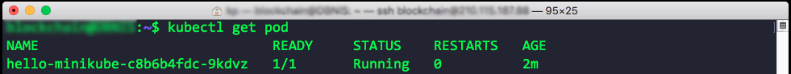
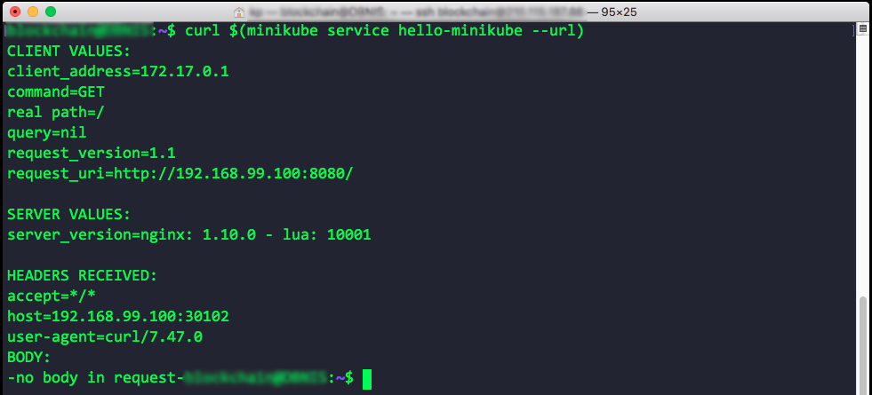
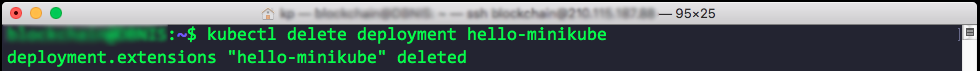
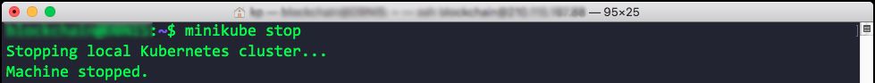

<h1 align="center">
  <br>
  <a href="https://kubernetes.io/"></a>
  <br>
  Kubernetes
  <br>
</h1>

[![Submit Queue Widget]][Submit Queue] [![GoDoc Widget]][GoDoc] [](https://bestpractices.coreinfrastructure.org/projects/569)

----

Kubernetes is an open source system for managing [containerized applications]
across multiple hosts; providing basic mechanisms for deployment, maintenance,
and scaling of applications.

Kubernetes builds upon a decade and a half of experience at Google running
production workloads at scale using a system called [Borg],
combined with best-of-breed ideas and practices from the community.

Kubernetes is hosted by the Cloud Native Computing Foundation ([CNCF]).
If you are a company that wants to help shape the evolution of
technologies that are container-packaged, dynamically-scheduled
and microservices-oriented, consider joining the CNCF.
For details about who's involved and how Kubernetes plays a role,
read the CNCF [announcement].

----

## 🚩 Table of Contents

- [Environment](#environment)
- [Minikube](#minikube-overview)
  - [Install kubectl](#install-kubectl)
  - [Install minikube](#install-minikube)
  - [Basic minikube commands](#basic-minikube-commands)
- [Your First K8S App](#your-first-k8s-app)
- [Source Code Example](#-source-code-example)
- [Contributing](#-contributing)
- [License](#-license)


## Environment
It depends on who you are & what you’re using it for
- Evaluation/Training - minikube (local version of k8s)
- Development - minikube, dev cluster on a cloud provider
- Deployment - cloud provider or bare metal

[(Back to top)](#-table-of-contents)

## Minikube Overview
- An all-in-one install of Kubernetes
- Takes all the distributed components of Kubernetes and packages them into a single virtual machine to run locally
- A Few (Important) Caveats:
  - Minikube does not support Cloud Provider specific features such as Load Balancers, Persistent Volumes, Ingress (Don’t worry about these yet if you don’t know what these mean!)
  - Minikube requires Virtualization - on Linux Virtualbox must be installed and on OS X either Virtualbox or VMWare Fusion
- Minikube will be a Kubernetes cluster running on your machine
- We’ll start minikube and then connect to it from the kubernetes command line tools (kubectl), just as you will when connecting to kubernetes clusters running remotely

###### Step to install Minikube

- Start with a Linux or Mac OS X machine with a hypervisor installed
- Install kubectl
- Install minikube

[(Back to top)](#-table-of-contents)

## Install kubectl
[Official website](https://kubernetes.io/docs/tasks/tools/install-kubectl/#install-kubectl-binary-via-curl)

### 1. Download the latest package for your OS**
- #### Linux
  ```
  curl -LO https://storage.googleapis.com/kubernetes-release/release/$(curl -s https://storage.googleapis.com/kubernetes-release/release/stable.txt)/bin/linux/amd64/kubectl
  ```

- #### OS X
  ```
  curl -LO https://storage.googleapis.com/kubernetes-release/release/$(curl -s https://storage.googleapis.com/kubernetes-release/release/stable.txt)/bin/darwin/amd64/kubectl
  ```

- #### Windows
  Download the latest release v1.11.0 from [this link](https://storage.googleapis.com/kubernetes-release/release/v1.11.0/bin/windows/amd64/kubectl.exe). Or if you have curl installed, use this command:
  ```
  curl -LO https://storage.googleapis.com/kubernetes-release/release/v1.11.0/bin/windows/amd64/kubectl.exe
  ```
  To find out the latest stable version (for example, for scripting), take a look at https://storage.googleapis.com/kubernetes-release/release/stable.txt.

### 2. Make the binary executable (macOS and Linux only)
  ```
  chmod +x ./kubectl
  ```
### 3. Add the binary to your PATH
- #### Linux
  ```
  sudo mv ./kubectl /usr/local/bin/kubectl
  ```
- #### OS X
  ```
  sudo mv ./kubectl /usr/local/bin/kubectl
  ```
- #### Windows
  Use Explorer to move the kubectl binary to a directory in your path of your choice.

----
- Latest installation instruction for macOS*, Linux, and Windows are always available online:
  - "Install and Set Up kubectl in the Kubernetes Documentation
  - macOS users should consider using the "homebrew" package manager to install and manager kubectl
  - Google Cloud Platform users may also use the Google Cloud Platform tools to install kubectl, consult Google’s SDK for information
----
[(Back to top)](#-table-of-contents)
### Testing kubectl
```
kubectl version
```


**Note:** Version and GitCommit might be different.

[(Back to top)](#-table-of-contents)

## Install minikube
[Official minikude github](https://github.com/kubernetes/minikube/releases)
- #### Linux
  ```
  curl -Lo minikube https://storage.googleapis.com/minikube/releases/v0.28.0/minikube-linux-amd64 && chmod +x minikube && sudo mv minikube /usr/local/bin/
  ```
  Feel free to leave off the `sudo mv minikube /usr/local/bin` if you would like to add minikube to your path manually.

- #### OS X
  ```
  curl -Lo minikube https://storage.googleapis.com/minikube/releases/v0.28.0/minikube-darwin-amd64 && chmod +x minikube && sudo mv minikube /usr/local/bin/
  ```
  Feel free to leave off the `sudo mv minikube /usr/local/bin` if you would like to add minikube to your path manually. Or you can install via homebrew with `brew cask install minikube`

- #### Windows
  Use browser download link from releases [link](https://github.com/kubernetes/minikube/releases)

  ###### Windows [Experimental]
  Download the `minikube-windows-amd64.exe` file, rename it to `minikube.exe` and add it to your path.

  ###### Windows Installer [Experimental]

  Download the `minikube-installer.exe` file, and execute the installer. This will automatically add minikube.exe to your path with an uninstaller available as well.

----
- Latest installation instruction for macOS*, Linux, and Windows are always available online:
  - "Minikube Releases" at the Minikube Github repository
  - Debian-based Linux & Windows users should consider using the installer packages listed at the above URL
----

[(Back to top)](#-table-of-contents)

## Basic minikube commands
- Start minikube
  ```
  minikube start
  ```
  

<br />

- Deploy a sample Kubernetes "deployment" to your local minikube
  ```
  kubectl run hello-minikube --image=gcr.io/google_containers/echoserver:1.4 --port=8080
  ```
  

<br />

- Expose this deployment to an external network
  ```
  kubectl expose deployment hello-minikube --type=NodePort
  ```
  

<br />

- List the “pods” of this deployment
  ```
  kubectl get pod
  ```
  

<br />

- Access the sample service
  ```
  curl $(minikube service hello-minikube --url)
  ```
  

<br />

- Delete the deployment
  ```
  kubectl delete deployment hello-minikube
  ```
  

<br />

- Stop minikube
  ```
  minikube stop
  ```
  

[(Back to top)](#-table-of-contents)

## Your First K8S App
We will deploy the Tomcat App Server using the official docker image.

#### 1. Define the deployment

[(Back to top)](#-table-of-contents)

## 📙 Source Code Example
- You can download latest code from [here](https://github.com/jleetutorial/kubernetes-demo).

[(Back to top)](#-table-of-contents)

## 💬 Contributing

Your contributions are always welcome! :tada:

1. Fork it!
2. Create your feature branch: `git checkout -b my-new-feature`
3. Commit your changes: `git commit -am 'Add some feature'`
4. Push to the branch: `git push origin my-new-feature`
5. Submit a pull request :D

## 📜 License

The MIT License (MIT) 2018
> GitHub [@yinkokpheng](https://github.com/yinkokpheng)


[GoDoc]: https://godoc.org/k8s.io/kubernetes
[GoDoc Widget]: https://godoc.org/k8s.io/kubernetes?status.svg
[Submit Queue]: http://submit-queue.k8s.io/#/ci
[Submit Queue Widget]: http://submit-queue.k8s.io/health.svg?v=1
